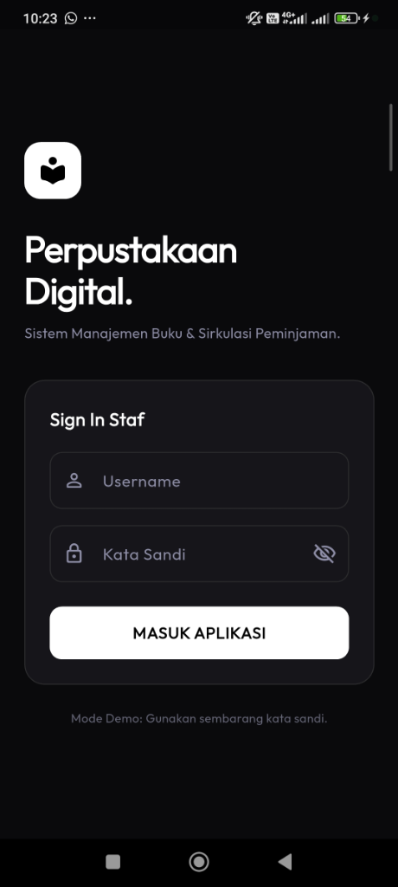
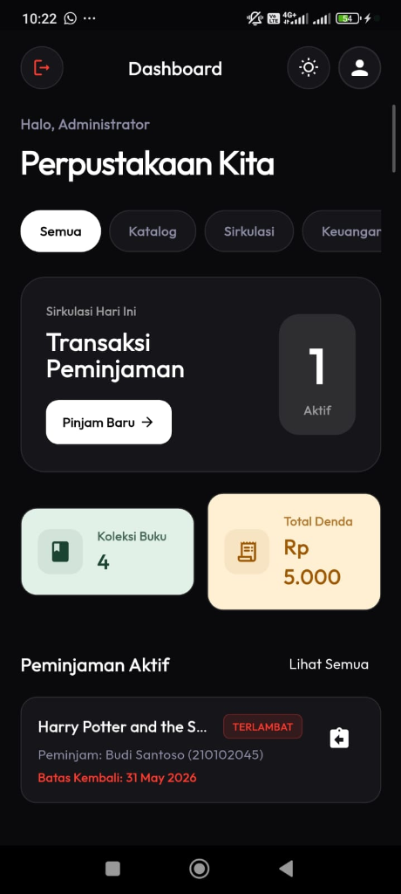
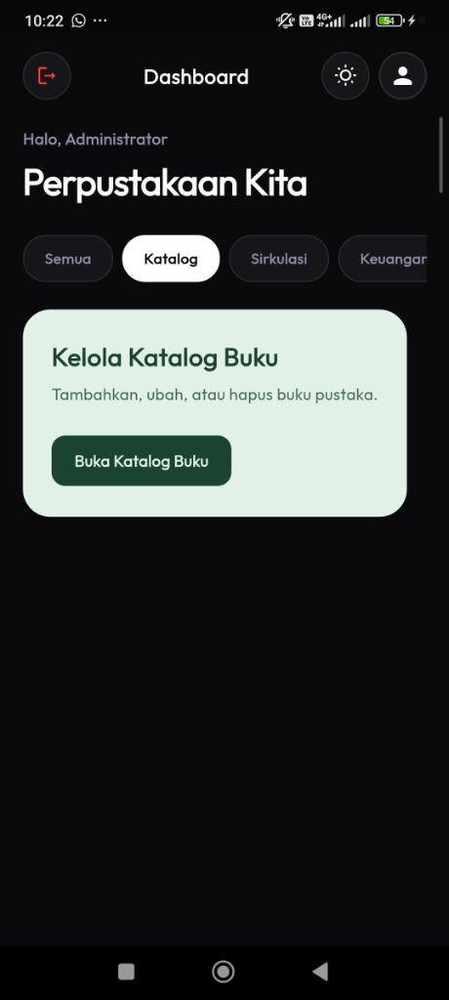
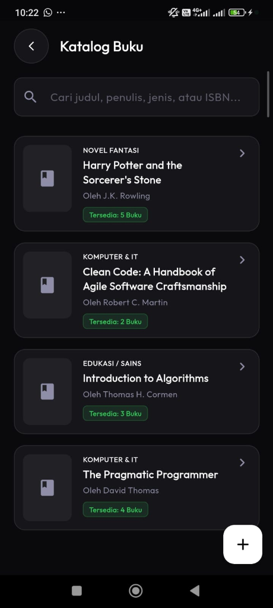
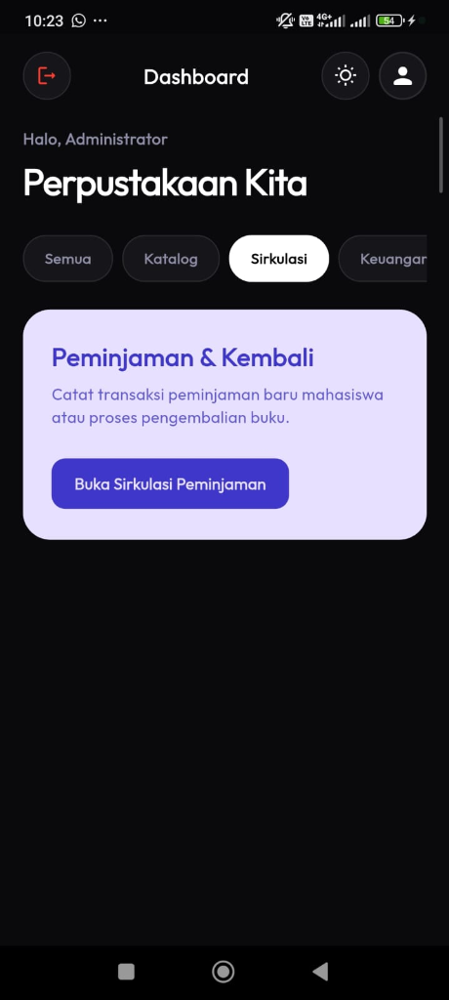
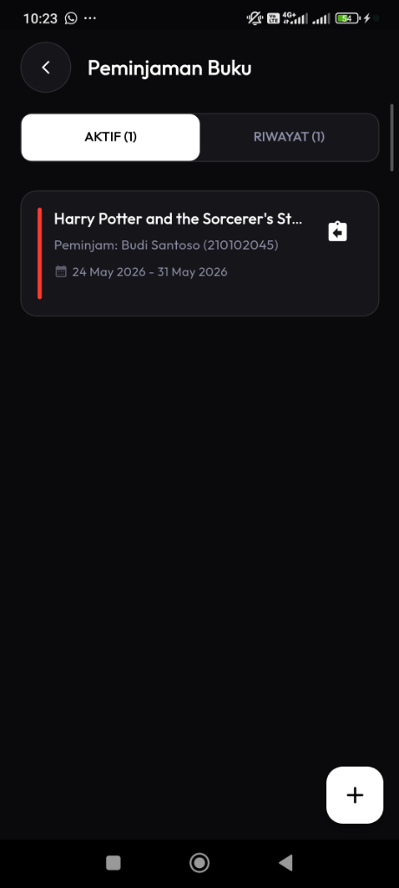
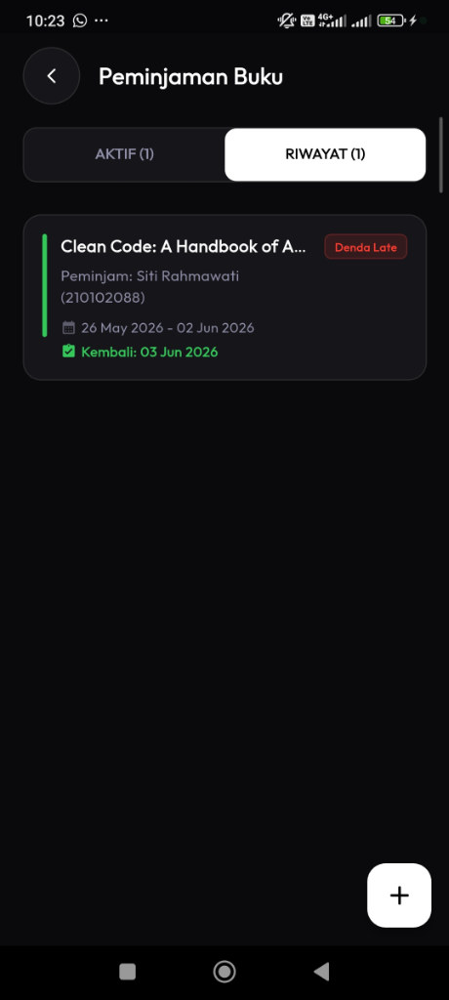
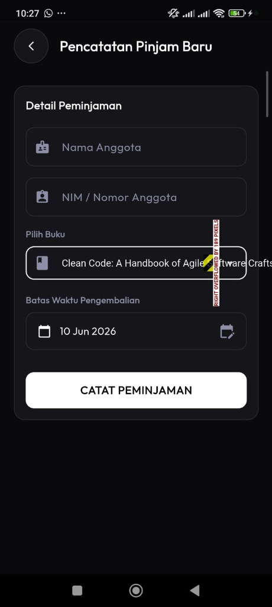
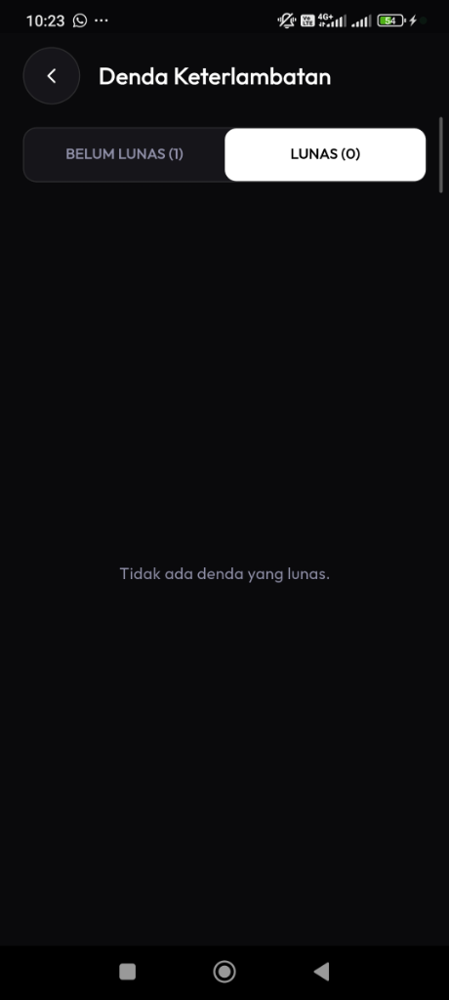

# 📚 Perpus App - Aplikasi Perpustakaan Digital

Aplikasi Client Mobile Perpustakaan Digital yang dibangun menggunakan **Flutter** dengan penerapan **Clean Architecture**, **Provider State Management**, dan estetika **UI Monokrom (Hitam & Putih) Minimalis Modern** yang dilengkapi fitur **Theme Switcher (Light/Dark Mode)**.

Aplikasi ini terintegrasi dengan backend [Golang Perpustakaan RESTful API](https://github.com/afrizal423/Golang-Perpustakaan-Restful-API).

---

## 📸 Screenshots & Preview

Berikut adalah cuplikan antarmuka (UI) lengkap aplikasi dalam **Dark Mode (Tema Gelap)** yang menampilkan estetika minimalis modern beresolusi tinggi dengan sentuhan aksen warna pastel solid yang premium:

### 🔑 Autentikasi & Dashboard Utama

| 1. Halaman Login (Sign In Staf) | 2. Dashboard Utama (Ringkasan & Aksi) |
| :---: | :---: |
| Halaman masuk staf dengan tipografi tebal (`Perpustakaan\nDigital.`), ikon brand minimalis, serta tombol aksi dengan kontras tinggi yang bersih. | Pusat informasi yang menampilkan sapaan staf, toggle tema, data counter peminjaman aktif, indikator pastel koleksi buku & total denda, serta sirkulasi terlambat. |
|  |  |

---

### 📖 Modul Katalog Buku

| 3. Akses Cepat Modul Katalog | 4. Daftar Katalog Buku |
| :---: | :---: |
| Panel menu pintas sirkulasi kategori dashboard untuk membuka katalog buku dengan warna latar belakang hijau mint pastel solid. | Daftar koleksi buku lengkap yang dikelola menggunakan kartu solid datar (`CustomCard`) dengan filter pencarian dan tombol tambah buku (+). |
|  |  |

---

### 🔄 Modul Sirkulasi Peminjaman

| 5. Akses Cepat Modul Sirkulasi | 6. Daftar Peminjaman Aktif | 7. Riwayat Sirkulasi & Denda | 8. Formulir Pinjam Baru |
| :---: | :---: | :---: | :---: |
| Panel menu pintas sirkulasi kategori dashboard untuk modul peminjaman buku berwarna ungu lavender pastel solid. | Daftar peminjaman buku aktif mahasiswa yang sedang dipinjam dengan aksi cepat tombol kembalikan buku. | Riwayat transaksi buku yang telah dikembalikan, lengkap dengan badge status denda keterlambatan jika ada. | Formulir pencatatan peminjaman baru mahasiswa dengan validasi nama, NIM, pilihan buku (aman dari *overflow*), dan pemilihan batas kembali. |
|  |  |  |  |

---

### 💰 Modul Keuangan & Denda

| 9. Laporan Denda Belum Lunas | 10. Laporan Denda Lunas |
| :---: | :---: |
| Daftar pencatatan denda keterlambatan mahasiswa yang belum dibayar, lengkap dengan tombol konfirmasi pembayaran. | Halaman riwayat denda yang telah lunas (bersih dari tunggakan denda). |
|  |  |

---

## ✨ Fitur Utama

- **Premium Monochrome UI**: Tampilan antarmuka beresolusi tinggi dengan skema warna Hitam & Putih yang clean, elegan, dan fungsional.
- **Dynamic Theme Switcher**: Mengubah tema (Light & Dark Mode) secara instan melalui tombol toggle di dashboard. Pilihan tema otomatis tersimpan di memori lokal menggunakan `SharedPreferences`.
- **Clean Architecture & State Management**: Pembagian kode yang rapi berdasarkan layer (`core`, `data`, `domain`, `presentation`) dan pengelolaan state reaktif menggunakan `Provider`.
- **Manajemen Katalog & Sirkulasi**:
  - **Dashboard Utama**: Ringkasan data sirkulasi aktif, pintasan transaksi baru, dan panel kategori intuitif.
  - **Koleksi Buku (Katalog)**: Menampilkan daftar buku lengkap beserta sampul, detail buku, serta form tambah/edit buku.
  - **Sirkulasi Peminjaman**: Pencatatan transaksi peminjaman buku baru mahasiswa, daftar peminjaman aktif, dan pemrosesan pengembalian buku secara langsung.
  - **Sistem Denda**: Laporan otomatis keterlambatan pengembalian buku dan pencatatan pembayaran denda.

---

## 🏗️ Arsitektur & Struktur Folder

Aplikasi dirancang dengan mengikuti pola **Clean Architecture** untuk memastikan kode mudah dirawat (maintainable), diuji (testable), dan dikembangkan (scalable):

```text
lib/
├── core/                  # Utilitas global, konstanta, tema, & klien jaringan
│   ├── constants/         # AppColors, konfigurasi global
│   ├── network/           # ApiClient (HTTP/REST client)
│   ├── theme/             # AppTheme (Light & Dark ThemeData)
│   └── utils/             # DateFormatter, ViewState
├── domain/                # Layer Bisnis / Logika Inti (Bebas framework)
│   ├── entities/          # Entitas data (Buku, Peminjaman, Denda, User)
│   └── repositories/      # Interface/Kontrak repositori data
├── data/                  # Layer Implementasi Data
│   ├── models/            # Serialisasi JSON (BukuModel, UserModel, dll)
│   ├── datasources/       # Sumber data (API/Remote & Local Mock database)
│   └── repositories/      # Realisasi konkret dari kontrak Domain Repositories
├── presentation/          # Layer UI (Framework & State Management)
│   ├── providers/         # Controller/State Provider (Auth, Buku, Peminjaman, Denda, Theme)
│   ├── screens/           # Tampilan UI Halaman (Auth, Dashboard, Buku, Peminjaman, Denda)
│   └── widgets/           # Komponen widget reusable (CustomCard, CustomButton, CustomTextField, dll)
└── main.dart              # Titik masuk aplikasi (Setup multi-provider)
```

---

## 🚀 Memulai & Instalasi

### Prasyarat
- [Flutter SDK](https://docs.flutter.dev/get-started/install) (versi terbaru direkomendasikan)
- Dart SDK
- Android SDK (untuk menjalankan di Emulator/HP Android)

### Langkah Langkah Jalankan Aplikasi

1. **Clone repository ini:**
   ```bash
   git clone https://github.com/wishaputra/perpus-app.git
   cd perpus-app
   ```

2. **Dapatkan dependencies project:**
   ```bash
   flutter pub get
   ```

3. **Jalankan Uji Coba Unit & Widget:**
   ```bash
   flutter test
   ```

4. **Konfigurasi API Endpoint (Opsional):**
   Ubah base URL server API Anda pada berkas [api_client.dart](file:///c:/someshit/test%20flutter/lib/core/network/api_client.dart) untuk menghubungkan aplikasi ke backend Golang sesungguhnya.

5. **Jalankan Aplikasi:**
   Koneksikan perangkat HP Anda melalui kabel USB (aktifkan USB Debugging) atau jalankan Emulator Android/iOS, kemudian ketik:
   ```bash
   flutter run
   ```

---

## 🛠️ Tech Stack & Dependencies

- **Framework**: Flutter (Dart)
- **State Management**: `provider`
- **Penyimpanan Lokal (Persistence)**: `shared_preferences`
- **HTTP Client**: `http`
- **Pengujian**: `flutter_test`
